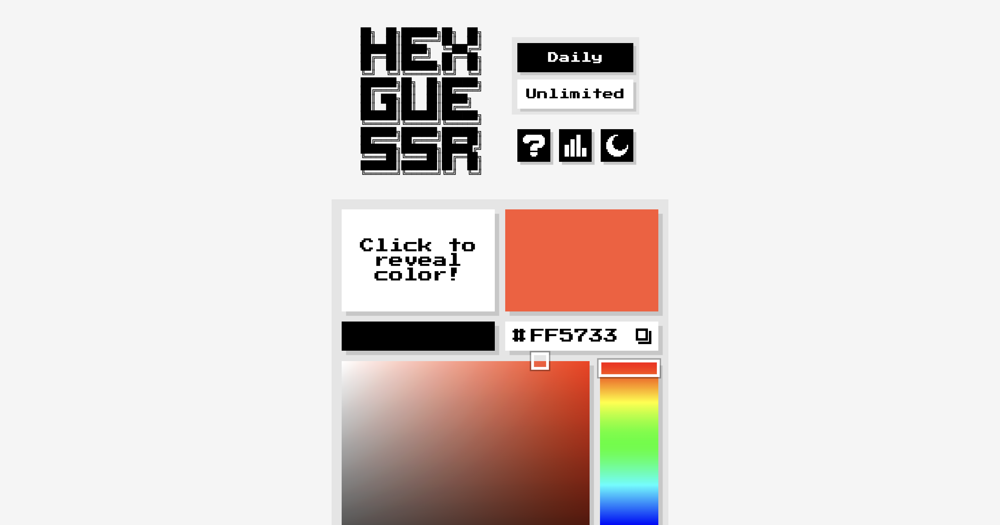

# HexGuessr



`Link`: [hexguessr.com](https://hexguessr.com)

`Fallback`: [hexguessr.pages.dev](https://hexguessr.pages.dev)

A retro-inspired web game where you attempt to guess a target color's hex code within 5 tries.

HexGuessr combines Wordle-style per-character feedback with a live color picker so you can reason visually and numerically at the same time.

## Gameplay

- Guess a 6-digit hex color (`#000000` to `#FFFFFF`) in up to 5 attempts.
- Use the reveal square once per attempt to briefly preview the target color.
- Refine guesses using the color canvas, hue slider, and hex output field.
- Submit guesses into the 5x6 grid.

### Feedback Rules

Each character gets one of four colored feedback states:

- `Green`: digit in position is correct.
- `Yellow`: digit is off by 1 (example: `7` or `9` when target is `8`).
- `Orange`: digit is off by 2 or 3 (example: `5`/`6` or `A`/`B` when target is `8`).
- `Gray`: digit is off by more than 3.

## Modes

- `Daily`: one shared color per UTC day for everyone.
- `Unlimited`: endless random colors for practice.

## Features

- Pixel-art UI with responsive scaling system.
- Light/Dark mode toggle (saved in `localStorage`).
- In-game stats modal (per mode):
  - Games played / won / lost
  - Win percentage
  - Current / max streak
  - Average guesses
  - Guess accuracy
  - Guess efficiency
- Daily persistence:
  - Ongoing game state survives refresh.
  - Completed daily stays completed for that day.
- Keyboard + on-screen keypad input.
- Copy/paste helpers for hex values.
- Accessible modal behavior (focus trap, escape to close, blocked background input).

## Tech Stack

- Frontend: vanilla `HTML`, `CSS`, `JavaScript`
- Daily API: Cloudflare Pages Functions (`functions/api/daily-color.js`)
- Routing/headers: `_redirects` + `_headers`

## Local Development

Local dev uses Wrangler so both `Daily` and `Unlimited` modes work the same as in production. Requires `Node.js` version `18` or newer.

### 1) Add a local secret

Create a `.dev.vars` file in the project root. Wrangler reads it automatically.

```bash
# .dev.vars
SECRET_SALT=any-long-random-string-for-local
```

`.dev.vars` is gitignored. The value doesn't matter locally — just don't reuse a real production secret.

### 2) Run the dev server

```bash
npx wrangler pages dev .
```

Open the URL Wrangler prints (typically `http://localhost:8788`).

- `/` → Daily mode
- `/unlimited` → Unlimited mode
- `/api/daily-color` → local Pages Function

### Troubleshooting

- Daily shows the retry screen → `SECRET_SALT` not loaded. Check `.dev.vars` and restart Wrangler.
- `/unlimited` returns 404 → you're on a plain static server (e.g. `python3 -m http.server`); `_redirects` only works under Wrangler.
- Daily color identical between reloads → expected. Daily is deterministic per UTC day.

## Deployment (Cloudflare Pages)

Static site + Pages Functions. No build step; Cloudflare serves the repo root and auto-detects `functions/`.

1. Connect this repo to Cloudflare Pages.
2. Build configuration — leave all fields blank (Build command, Build output directory, Root directory).
3. Add `SECRET_SALT` as an environment variable in **both** Production and Preview. Preview needs it too, otherwise preview deploys hit the Daily retry screen.
4. Push to `main`. Automatic deployments are enabled.

### Why `SECRET_SALT` matters

The daily color is generated server-side using `HMAC(date, SECRET_SALT)`, then converted to RGB/hex. This makes the daily color deterministic per day but not guessable from client code alone.

## Project Structure

```text
.
├── index.html
├── 404.html
├── styles.css
├── app.js
├── functions/
│   └── api/
│       └── daily-color.js
├── assets/
│   └── fonts/
├── _redirects
├── _headers
├── favicon.ico
├── favicon.png
└── og-image.png
```

## Data & Privacy

HexGuessr stores gameplay preferences and stats in browser `localStorage`:

- Theme preference
- Daily completion/state
- Stats per mode

No account system is required.

## Credits

- Game design & development: [KapuuZapuu](https://github.com/kapuuzapuu)
- Fonts: Press Start 2P, IBM Plex Mono
